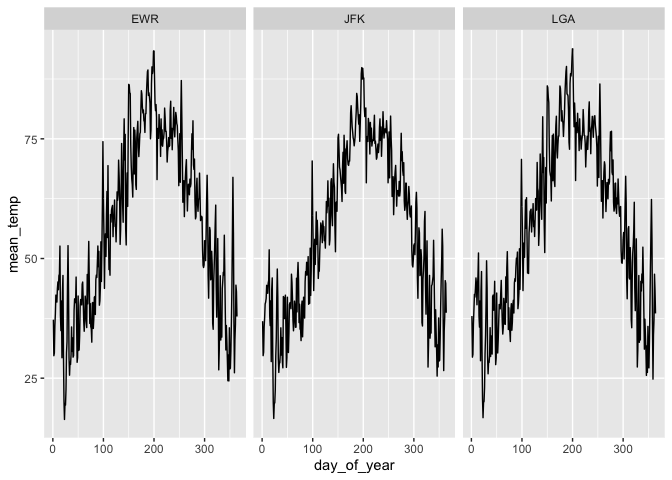

Practice Exam
=============

This practice exam asks you to do several code wrangling tasks that we
have done in class so far.

Clone this repo into Rstudio and fill in the necessary code. Then,
commit and push to github. Finally, turn in a link to canvas.

    ## ── Attaching packages ─────────── tidyverse 1.3.0 ──

    ## ✔ ggplot2 3.2.1     ✔ purrr   0.3.3
    ## ✔ tibble  2.1.3     ✔ dplyr   0.8.3
    ## ✔ tidyr   1.0.0     ✔ stringr 1.4.0
    ## ✔ readr   1.3.1     ✔ forcats 0.4.0

    ## ── Conflicts ────────────── tidyverse_conflicts() ──
    ## ✖ dplyr::filter() masks stats::filter()
    ## ✖ dplyr::lag()    masks stats::lag()

    ## # A tibble: 6 x 19
    ##    year month   day dep_time sched_dep_time dep_delay arr_time
    ##   <int> <int> <int>    <int>          <int>     <dbl>    <int>
    ## 1  2013     1     1      517            515         2      830
    ## 2  2013     1     1      533            529         4      850
    ## 3  2013     1     1      542            540         2      923
    ## 4  2013     1     1      544            545        -1     1004
    ## 5  2013     1     1      554            600        -6      812
    ## 6  2013     1     1      554            558        -4      740
    ## # … with 12 more variables: sched_arr_time <int>, arr_delay <dbl>,
    ## #   carrier <chr>, flight <int>, tailnum <chr>, origin <chr>, dest <chr>,
    ## #   air_time <dbl>, distance <dbl>, hour <dbl>, minute <dbl>,
    ## #   time_hour <dttm>

    ## # A tibble: 6 x 15
    ##   origin  year month   day  hour  temp  dewp humid wind_dir wind_speed
    ##   <chr>  <int> <int> <int> <int> <dbl> <dbl> <dbl>    <dbl>      <dbl>
    ## 1 EWR     2013     1     1     1  39.0  26.1  59.4      270      10.4 
    ## 2 EWR     2013     1     1     2  39.0  27.0  61.6      250       8.06
    ## 3 EWR     2013     1     1     3  39.0  28.0  64.4      240      11.5 
    ## 4 EWR     2013     1     1     4  39.9  28.0  62.2      250      12.7 
    ## 5 EWR     2013     1     1     5  39.0  28.0  64.4      260      12.7 
    ## 6 EWR     2013     1     1     6  37.9  28.0  67.2      240      11.5 
    ## # … with 5 more variables: wind_gust <dbl>, precip <dbl>, pressure <dbl>,
    ## #   visib <dbl>, time_hour <dttm>

Make a plot with three facets, one for each airport in the weather data.
The x-axis should be the day of the year (1:365) and the y-axis should
be the mean temperature recorded on that day, at that airport.

    library(lubridate)

    ## 
    ## Attaching package: 'lubridate'

    ## The following object is masked from 'package:base':
    ## 
    ##     date

    data1 <- weather %>% 
      mutate(day_of_year = yday(time_hour)) %>% 
      left_join(flights) %>% 
      group_by(origin, day_of_year) %>% 
      summarise(mean_temp = mean(temp, na.rm = TRUE))

    ## Joining, by = c("origin", "year", "month", "day", "hour", "time_hour")

    data1 %>% 
      ggplot() + 
      geom_line(aes(x = day_of_year, y = mean_temp)) + 
      facet_wrap(~ origin, nrow = 1)

Make a non-tidy matrix of that data where each row is an airport and
each column is a day of the year.

    #head(data1)
    data1 %>% 
      pivot_wider(names_from = day_of_year, values_from = mean_temp)

    ## # A tibble: 3 x 365
    ## # Groups:   origin [3]
    ##   origin   `1`   `2`   `3`   `4`   `5`   `6`   `7`   `8`   `9`  `10`  `11`
    ##   <chr>  <dbl> <dbl> <dbl> <dbl> <dbl> <dbl> <dbl> <dbl> <dbl> <dbl> <dbl>
    ## 1 EWR     37.2  29.7  30.2  35.9  38.5  42.4  41.9  40.9  43.7  45.1  43.5
    ## 2 JFK     36.9  29.7  30.4  35.7  37.7  40.5  40.9  41.7  44.4  44.3  42.7
    ## 3 LGA     38.0  29.4  30.0  36.3  39.3  42.5  41.9  43.7  45.9  44.6  40.3
    ## # … with 353 more variables: `12` <dbl>, `13` <dbl>, `14` <dbl>,
    ## #   `15` <dbl>, `16` <dbl>, `17` <dbl>, `18` <dbl>, `19` <dbl>,
    ## #   `20` <dbl>, `21` <dbl>, `22` <dbl>, `23` <dbl>, `24` <dbl>,
    ## #   `25` <dbl>, `26` <dbl>, `27` <dbl>, `28` <dbl>, `29` <dbl>,
    ## #   `30` <dbl>, `31` <dbl>, `32` <dbl>, `33` <dbl>, `34` <dbl>,
    ## #   `35` <dbl>, `36` <dbl>, `37` <dbl>, `38` <dbl>, `39` <dbl>,
    ## #   `40` <dbl>, `41` <dbl>, `42` <dbl>, `43` <dbl>, `44` <dbl>,
    ## #   `45` <dbl>, `46` <dbl>, `47` <dbl>, `48` <dbl>, `49` <dbl>,
    ## #   `50` <dbl>, `51` <dbl>, `52` <dbl>, `53` <dbl>, `54` <dbl>,
    ## #   `55` <dbl>, `56` <dbl>, `57` <dbl>, `58` <dbl>, `59` <dbl>,
    ## #   `60` <dbl>, `61` <dbl>, `62` <dbl>, `63` <dbl>, `64` <dbl>,
    ## #   `65` <dbl>, `66` <dbl>, `67` <dbl>, `68` <dbl>, `69` <dbl>,
    ## #   `70` <dbl>, `71` <dbl>, `72` <dbl>, `73` <dbl>, `74` <dbl>,
    ## #   `75` <dbl>, `76` <dbl>, `77` <dbl>, `78` <dbl>, `79` <dbl>,
    ## #   `80` <dbl>, `81` <dbl>, `82` <dbl>, `83` <dbl>, `84` <dbl>,
    ## #   `85` <dbl>, `86` <dbl>, `87` <dbl>, `88` <dbl>, `89` <dbl>,
    ## #   `90` <dbl>, `91` <dbl>, `92` <dbl>, `93` <dbl>, `94` <dbl>,
    ## #   `95` <dbl>, `96` <dbl>, `97` <dbl>, `98` <dbl>, `99` <dbl>,
    ## #   `100` <dbl>, `101` <dbl>, `102` <dbl>, `103` <dbl>, `104` <dbl>,
    ## #   `105` <dbl>, `106` <dbl>, `107` <dbl>, `108` <dbl>, `109` <dbl>,
    ## #   `110` <dbl>, `111` <dbl>, …

For each (airport, day) contruct a tidy data set of the airport’s
“performance” as the proportion of flights that departed less than an
hour late.

    head(flights)

    ## # A tibble: 6 x 19
    ##    year month   day dep_time sched_dep_time dep_delay arr_time
    ##   <int> <int> <int>    <int>          <int>     <dbl>    <int>
    ## 1  2013     1     1      517            515         2      830
    ## 2  2013     1     1      533            529         4      850
    ## 3  2013     1     1      542            540         2      923
    ## 4  2013     1     1      544            545        -1     1004
    ## 5  2013     1     1      554            600        -6      812
    ## 6  2013     1     1      554            558        -4      740
    ## # … with 12 more variables: sched_arr_time <int>, arr_delay <dbl>,
    ## #   carrier <chr>, flight <int>, tailnum <chr>, origin <chr>, dest <chr>,
    ## #   air_time <dbl>, distance <dbl>, hour <dbl>, minute <dbl>,
    ## #   time_hour <dttm>

    perf_sum <- flights %>% 
      mutate(day_of_year = yday(time_hour)) %>% 
      group_by(origin, day_of_year) %>% 
      mutate(hr_dep_delay = dep_delay < 60) %>% 
      summarise(total_flights_cnt = n(),
                on_time_cnt = sum(hr_dep_delay, na.rm = TRUE),
                perf_prop = on_time_cnt / total_flights_cnt)

    head(perf_sum)

    ## # A tibble: 6 x 5
    ## # Groups:   origin [1]
    ##   origin day_of_year total_flights_cnt on_time_cnt perf_prop
    ##   <chr>        <dbl>             <int>       <int>     <dbl>
    ## 1 EWR              1               305         279     0.915
    ## 2 EWR              2               350         288     0.823
    ## 3 EWR              3               336         326     0.970
    ## 4 EWR              4               339         315     0.929
    ## 5 EWR              5               238         229     0.962
    ## 6 EWR              6               301         285     0.947

Construct a tidy data set to that give weather summaries for each
(airport, day). Use the total precipitation, minimum visibility, maximum
wind\_gust, and average wind\_speed.

    head(weather)

    ## # A tibble: 6 x 15
    ##   origin  year month   day  hour  temp  dewp humid wind_dir wind_speed
    ##   <chr>  <int> <int> <int> <int> <dbl> <dbl> <dbl>    <dbl>      <dbl>
    ## 1 EWR     2013     1     1     1  39.0  26.1  59.4      270      10.4 
    ## 2 EWR     2013     1     1     2  39.0  27.0  61.6      250       8.06
    ## 3 EWR     2013     1     1     3  39.0  28.0  64.4      240      11.5 
    ## 4 EWR     2013     1     1     4  39.9  28.0  62.2      250      12.7 
    ## 5 EWR     2013     1     1     5  39.0  28.0  64.4      260      12.7 
    ## 6 EWR     2013     1     1     6  37.9  28.0  67.2      240      11.5 
    ## # … with 5 more variables: wind_gust <dbl>, precip <dbl>, pressure <dbl>,
    ## #   visib <dbl>, time_hour <dttm>

    weather_sum <- weather %>% 
      mutate(day_of_year = yday(time_hour)) %>% 
      group_by(origin, day_of_year) %>% 
      summarise(total_precip = sum(precip, na.rm = TRUE),
                min_vis = min(visib, na.rm = TRUE),
                #max_wind_gust = max(wind_gust, na.rm = TRUE),
                avg_wind_sp = mean(wind_speed, na.rm = TRUE))

    head(weather_sum)

    ## # A tibble: 6 x 5
    ## # Groups:   origin [1]
    ##   origin day_of_year total_precip min_vis avg_wind_sp
    ##   <chr>        <dbl>        <dbl>   <dbl>       <dbl>
    ## 1 EWR              1            0      10       13.2 
    ## 2 EWR              2            0      10       10.9 
    ## 3 EWR              3            0      10        8.58
    ## 4 EWR              4            0      10       14.0 
    ## 5 EWR              5            0      10        9.40
    ## 6 EWR              6            0       6        9.11

Construct a linear model to predict the performance of each
(airport,day) using the weather summaries and a “fixed effect” for each
airport. Display the summaries.

    # fixed effect = create a dummy variable for airport
    # 3 levels of airports (1 or 0 for each airport) = 2 dummy variables so one is the baseline
    # lm(performance ~ origin + ..., data = data)

    sums <- perf_sum %>% 
      left_join(weather_sum)

    ## Joining, by = c("origin", "day_of_year")

    mod1 <- lm(perf_prop ~ origin + total_precip + min_vis  + avg_wind_sp, data = sums)
    summary(mod1)

    ## 
    ## Call:
    ## lm(formula = perf_prop ~ origin + total_precip + min_vis + avg_wind_sp, 
    ##     data = sums)
    ## 
    ## Residuals:
    ##      Min       1Q   Median       3Q      Max 
    ## -0.48233 -0.02133  0.02037  0.04548  0.24018 
    ## 
    ## Coefficients:
    ##                Estimate Std. Error t value Pr(>|t|)    
    ## (Intercept)   0.8260821  0.0105907  78.001  < 2e-16 ***
    ## originJFK     0.0329332  0.0068358   4.818 1.66e-06 ***
    ## originLGA     0.0200635  0.0067232   2.984  0.00291 ** 
    ## total_precip -0.0661011  0.0100461  -6.580 7.31e-11 ***
    ## min_vis       0.0125846  0.0009002  13.980  < 2e-16 ***
    ## avg_wind_sp  -0.0031213  0.0006675  -4.676 3.29e-06 ***
    ## ---
    ## Signif. codes:  0 '***' 0.001 '**' 0.01 '*' 0.05 '.' 0.1 ' ' 1
    ## 
    ## Residual standard error: 0.09006 on 1086 degrees of freedom
    ##   (3 observations deleted due to missingness)
    ## Multiple R-squared:  0.304,  Adjusted R-squared:  0.3008 
    ## F-statistic: 94.85 on 5 and 1086 DF,  p-value: < 2.2e-16

Repeat the above, but only for EWR. Obviously, exclude the fixed effect
for each airport.

    sums_EWR <- sums %>% 
      filter(origin == "EWR")

    mod2 <- lm(perf_prop ~ total_precip + min_vis  + avg_wind_sp, data = sums_EWR)
    summary(mod2)

    ## 
    ## Call:
    ## lm(formula = perf_prop ~ total_precip + min_vis + avg_wind_sp, 
    ##     data = sums_EWR)
    ## 
    ## Residuals:
    ##      Min       1Q   Median       3Q      Max 
    ## -0.37268 -0.03529  0.02258  0.05254  0.25066 
    ## 
    ## Coefficients:
    ##               Estimate Std. Error t value Pr(>|t|)    
    ## (Intercept)   0.823186   0.016908  48.687  < 2e-16 ***
    ## total_precip -0.065640   0.016828  -3.901 0.000114 ***
    ## min_vis       0.014317   0.001674   8.554 3.47e-16 ***
    ## avg_wind_sp  -0.004208   0.001122  -3.750 0.000206 ***
    ## ---
    ## Signif. codes:  0 '***' 0.001 '**' 0.01 '*' 0.05 '.' 0.1 ' ' 1
    ## 
    ## Residual standard error: 0.09309 on 360 degrees of freedom
    ##   (1 observation deleted due to missingness)
    ## Multiple R-squared:  0.3208, Adjusted R-squared:  0.3152 
    ## F-statistic: 56.69 on 3 and 360 DF,  p-value: < 2.2e-16
